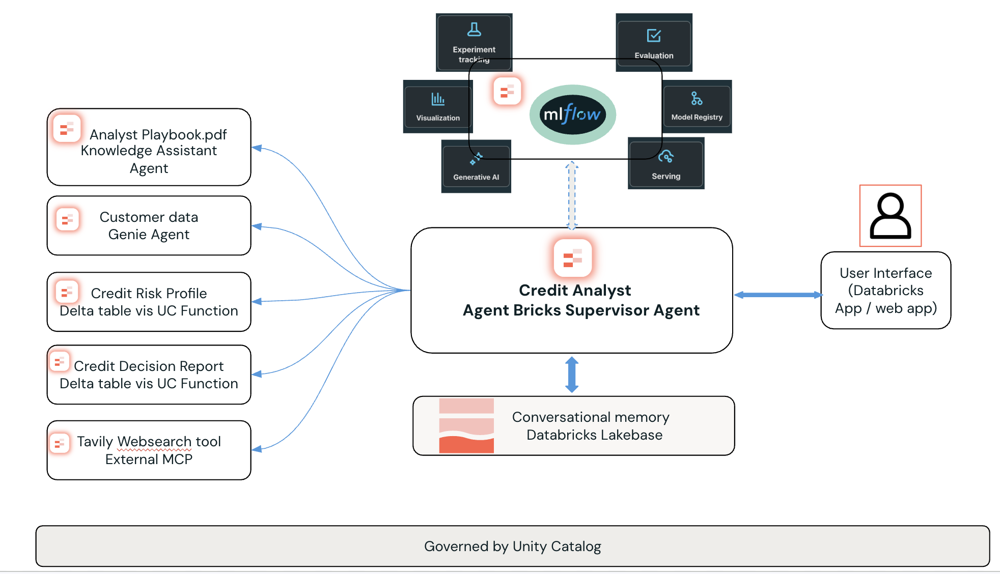

# Credit Risk Analyst — Multi-Agent Demo on Databricks

An end-to-end credit risk analysis solution using Databricks Agentbricks, Lakebase memory, and a React chat app. Built for Indian banking context with RBI/CIBIL compliance.

This is an extended version of the Databricks Solution: [Lakehouse Credit Decisioning](https://www.databricks.com/resources/demos/tutorials/lakehouse-platform/lakehouse-credit-decisioning)



---

## How It Works — 3 Steps

```
┌─────────────────────┐     ┌─────────────────────────┐     ┌──────────────────────┐
│  Step 1: SETUP      │     │  Step 2: BUILD AGENT     │     │  Step 3: DEPLOY APP  │
│                     │     │                          │     │                      │
│  ./setup/00_install │────▶│  Agentbricks on platform │────▶│  Databricks App      │
│                     │     │  (manual on UI)          │     │  (app/ folder)       │
│  Creates:           │     │                          │     │                      │
│  - Tables           │     │  Creates:                │     │  Provides:           │
│  - UC Functions     │     │  - Supervisor Agent      │     │  - Chat UI           │
│  - Vector Search    │     │  - Serving Endpoint      │     │  - Lakebase Memory   │
│  - Genie Space      │     │                          │     │  - Audit Trail       │
│  - Lakebase         │     │                          │     │                      │
└─────────────────────┘     └─────────────────────────┘     └──────────────────────┘
```

---

## Step 1: Install Data Assets

One command provisions everything your agent needs.

```bash
# Clone the repo
git clone https://github.com/sarbaniAi/credit-risk-analyst.git
cd credit-risk-analyst

# Run the installer (pass your Databricks CLI profile)
./setup/00_install.sh <databricks-profile>

# Or override catalog via env var
UC_CATALOG="your_catalog" ./setup/00_install.sh <databricks-profile>
```

### What Gets Created

| # | Asset | Description |
|---|-------|-------------|
| 1 | **Catalog & Schema** | Unity Catalog namespace for all assets |
| 2 | **Volume** | `credit_docs` — stores CSVs and PDFs |
| 3 | **Table** `underbanked_prediction` | 1000 Indian banking customers with financial profiles and risk predictions |
| 4 | **Table** `cust_personal_info` | 100 customers with Indian names, emails, phone numbers |
| 5 | **Table** `rag_chunks` | Credit policy, product routing, and RBI compliance knowledge base |
| 6 | **UC Function** `get_customer_details` | TABLE function — lookup customer by ID |
| 7 | **UC Function** `credit_report_generator` | SCALAR function — AI-generated credit risk report via `ai_query` |
| 8 | **Vector Search Endpoint** | `credit-risk-vs-endpoint` — STANDARD, auto-provisioned |
| 9 | **Vector Search Index** | `credit_policy_index` — Delta Sync with managed embeddings |
| 10 | **Genie Space** | AI/BI Genie with both tables and sample questions |
| 11 | **Lakebase** | `credit-risk-lakebase` — Postgres for conversation memory |

### Configuration

Edit `setup/config.py` or set environment variables:

| Setting | Default | Env Var |
|---------|---------|---------|
| `CATALOG` | `fsi_credit_agent` | `UC_CATALOG` |
| `SCHEMA` | `agent_schema` | `UC_SCHEMA` |
| `AGENT_MODEL` | `databricks-gpt-oss-120b` | `AGENT_MODEL` |
| `NUM_CUSTOMERS_FULL` | `1000` | `NUM_CUSTOMERS_FULL` |

Environment variables override `config.py` values.

---

## Step 2: Build the Agent (Agentbricks on Platform)

Use [Databricks Agentbricks](https://docs.databricks.com/aws/en/generative-ai/agent-bricks/) to create a **Supervisor Agent** that orchestrates the tools from Step 1.

### Agent Tools to Connect

| Tool | Source | Purpose |
|------|--------|---------|
| **Knowledge Assistant** | Vector Search index (`credit_policy_index`) | RAG — credit policy, product rules, RBI compliance |
| **Customer Data (Genie)** | Genie Space | Natural language queries on customer tables |
| **Credit Risk Profile** | UC Function `get_customer_details` | Structured customer lookup |
| **Credit Report Generator** | UC Function `credit_report_generator` | AI-generated risk assessment |

### Steps

1. Go to your Databricks workspace
2. Navigate to **Machine Learning → Agents → Create Agent**
3. Select **Supervisor Agent** pattern
4. Add the tools listed above
5. Test in the playground
6. **Deploy as a Serving Endpoint** — note the endpoint name for Step 3

---

## Step 3: Deploy the App

The `app/` folder contains a Databricks App with a React chat UI and Lakebase-powered conversation memory.

### Configure

Update **3 values** in `app/app.yaml`:

```yaml
env:
  - name: DATABRICKS_HOST
    value: "https://your-workspace.cloud.databricks.com"   # ← Your workspace URL
  - name: SERVING_ENDPOINT
    value: "your-agent-endpoint"                            # ← From Step 2
  - name: LAKEBASE_INSTANCE_NAME
    value: "credit-risk-lakebase"                           # ← From Step 1

resources:
  serving_endpoints:
    - name: your-agent-endpoint                             # ← Same as above
      permission: CAN_QUERY
```

Update the endpoint in `app/src/services/agentService.js`:

```javascript
const AGENT_ENDPOINT = '/api/serving-endpoints/your-agent-endpoint/invocations';
```

### Build & Deploy

```bash
cd app
npm install
npm run build
cd ..

# Deploy to Databricks
databricks apps deploy credit-risk-analyst --source-code-path app/ --profile <databricks-profile>
```

### App Features

| Feature | How |
|---------|-----|
| **Chat UI** | React with streaming responses |
| **Conversation Memory** | Lakebase — remembers past analyses across sessions |
| **Memory Recall** | "What customers have I analyzed?" works across sessions |
| **Audit Trail** | Full conversation history stored in `app_conversation_history` |
| **Per-User Isolation** | Each user has their own memory space via SSO |

### Lakebase Memory Tables

| Table | Purpose |
|-------|---------|
| `app_conversation_history` | Full message history (thread_id, user_id, role, content) |
| `app_user_memories` | Long-term learned facts (customer IDs, risk levels, emails) |
| `app_conversation_summaries` | Thread summaries with customer IDs discussed |

These tables are created automatically by `setup/06_create_lakebase.py`. If Lakebase API is not available, the SQL is printed for manual execution.

---

## Project Structure

```
credit-risk-analyst/
├── README.md
├── setup/                                      # Step 1: Data Installation
│   ├── 00_install.sh                           # One-command installer
│   ├── config.py                               # Central config (catalog, schema, models)
│   ├── 01_create_catalog.py                    # Create catalog, schema, volume
│   ├── 02_generate_data.py                     # Generate 1000 Indian banking synthetic records
│   ├── 03_create_functions.py                  # Create UC functions
│   ├── 04_load_rag_chunks.py                   # Load markdown knowledge docs → Delta table
│   ├── 05_create_vector_search.py              # Create Vector Search endpoint + index
│   ├── 06_create_lakebase.py                   # Create Lakebase instance + memory tables
│   └── knowledge_docs/                         # RAG knowledge base (markdown)
│       ├── 01_credit_decision_logic_playbook.md
│       ├── 02_product_routing_rules.md
│       └── 03_rbi_compliance_checklist.md
├── app/                                        # Step 3: Databricks App
│   ├── app.py                                  # Flask backend with Lakebase memory
│   ├── app.yaml                                # Databricks App config (update 3 values)
│   ├── requirements.txt                        # Python dependencies
│   ├── index.html                              # Frontend entry point
│   ├── package.json                            # Node.js dependencies
│   ├── vite.config.js                          # Vite build config
│   └── src/                                    # React frontend source
│       ├── App.jsx                             # Chat interface
│       ├── components/
│       │   ├── ChatMessage.jsx                 # Message display
│       │   └── MemoryPanel.jsx                 # Memory viewer panel
│       └── services/
│           └── agentService.js                 # Agent API client (update endpoint)
├── sample_data/                                # Generated after running setup
│   ├── underbanked_prediction.csv
│   └── cust_personal_info.csv
└── images/                                     # Architecture diagrams
```

---

## Architecture

```
┌─────────────────────────────────────────────────────────────────┐
│                    Databricks App (React Chat UI)                │
└─────────────────────────────────────────────────────────────────┘
                                │
                                ▼
┌─────────────────────────────────────────────────────────────────┐
│                    Flask Backend (app.py)                        │
│  ┌─────────────┐  ┌─────────────┐  ┌─────────────────────────┐ │
│  │   Memory    │  │   Memory    │  │      Agent Proxy        │ │
│  │  Injection  │  │ Extraction  │  │  (Serving Endpoint)     │ │
│  └─────────────┘  └─────────────┘  └─────────────────────────┘ │
└─────────────────────────────────────────────────────────────────┘
          │                                       │
          ▼                                       ▼
┌──────────────────────┐              ┌──────────────────────────┐
│  Lakebase (Postgres) │              │  Agentbricks Supervisor  │
│  - conversation_     │              │  ┌────────────────────┐  │
│    history           │              │  │ Knowledge Assistant│  │
│  - user_memories     │              │  │ (Vector Search)    │  │
│  - conversation_     │              │  ├────────────────────┤  │
│    summaries         │              │  │ Genie Agent        │  │
│                      │              │  │ (Customer Data)    │  │
└──────────────────────┘              │  ├────────────────────┤  │
                                      │  │ UC Functions       │  │
                                      │  │ (Risk Profile &    │  │
                                      │  │  Credit Report)    │  │
                                      │  └────────────────────┘  │
                                      └──────────────────────────┘
                                                  │
                                                  ▼
                                      ┌──────────────────────────┐
                                      │  Unity Catalog           │
                                      │  (Tables, Functions,     │
                                      │   Models — all governed) │
                                      └──────────────────────────┘
```

---

## Usage Examples

```
# Analyze a customer
"Analyze customer 34997"

# Get credit report
"Generate a credit risk report for customer 10042"

# Query policy
"What are the RBI guidelines for NPA classification?"

# Memory recall (in a new session)
"What customers have I analyzed?"
"What was the risk level of my last customer?"
```

---

## Troubleshooting

| Issue | Solution |
|-------|----------|
| Catalog creation fails | Installer shows available catalogs — use one via `UC_CATALOG` env var |
| Tables show 0 rows | Cold warehouse — installer retries automatically (3 attempts) |
| Vector Search endpoint not ONLINE | Wait 5-10 minutes, installer polls automatically |
| Lakebase API not found | Create manually via SQL Editor → Lakebase |
| `psycopg2` not found | Already in `app/requirements.txt` — redeploy the app |
| 404 on serving endpoint | Verify endpoint name matches in `app.yaml` AND `agentService.js` |

---

## Technologies

- **Databricks Agentbricks** — Multi-agent supervisor pattern
- **Databricks Lakebase** — Managed PostgreSQL for conversation memory
- **Databricks Apps** — SSO-enabled app hosting
- **Unity Catalog** — Governed functions, tables, and models
- **Vector Search** — RAG with managed embeddings (`databricks-gte-large-en`)
- **AI/BI Genie** — Natural language data exploration
- **React + Vite** — Frontend chat UI
- **Flask** — Backend API with memory layer

## Author

Sarbani Maiti — Databricks
